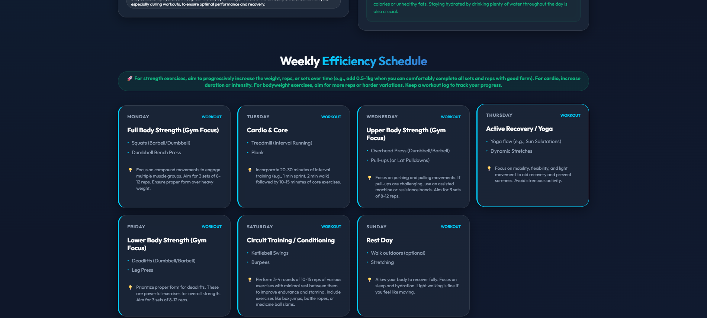
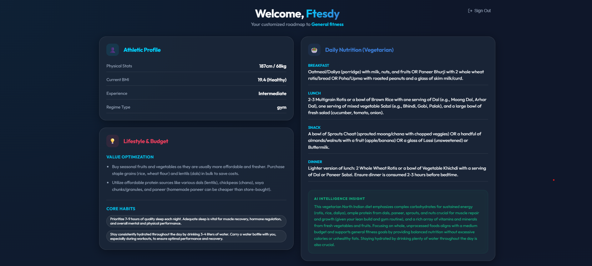
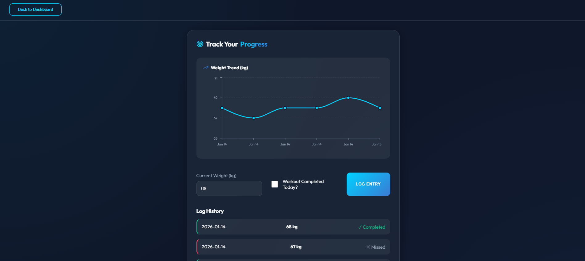

# 🤖 AI Workout & Nutrition Planner

A modern, personalized fitness companion built specifically for students. This application uses **Google Gemini AI** to generate custom workout and diet plans based on your fitness level, goal, budget, and local environment.

## 📱 App Preview

<p align="center">
  
  
  
</p>

> **Note:** Ensure you have uploaded `dashboard.png`, `plan-generation.png`, and `progress-tracker.png` to your `/public` folder for these to display.

---

## 🌟 Key Features

-   **Dynamic AI Plan Generation**: Integrated with **Gemini 2.5 Flash** for personalized weekly schedules.
-   **Student-Centric Logic**: Tailors plans for "Hostel", "Home", or "Gym" settings with a focus on affordable nutrition.
-   **Supabase Integration**: Secure authentication (Google/GitHub) and real-time database for storing plans and logs.
-   **Progress Tracker**: Interactive weight trend charts powered by **Recharts**.
-   **Premium Glassmorphism UI**: A sleek, high-density dashboard inspired by modern health apps.
-   **Smart Layout**: Balanced columns that eliminate empty space and optimize information density.

## 🛠️ Tech Stack

-   **Frontend**: React (Vite)
-   **AI Model**: Google Generative AI (@google/generative-ai)
-   **Database & Auth**: Supabase
-   **Styling**: Vanilla CSS (Custom Glassmorphism)
-   **Icons**: Lucide React
-   **Charts**: Recharts

## 🚀 Getting Started

### 1. Prerequisites
-   Node.js installed
-   A [Google AI Studio](https://aistudio.google.com/) API Key for Gemini
-   A [Supabase](https://supabase.com/) project

### 2. Installation
```bash
git clone [https://github.com/Venu3421/Workout-Planner.git](https://github.com/Venu3421/Workout-Planner.git)
cd Workout-Planner
npm install

```

### 3. Environment Variables

Create a `.env` file in the root directory and add your keys:

```env
VITE_SUPABASE_URL=your_supabase_url
VITE_SUPABASE_ANON_KEY=your_supabase_anon_key
VITE_GEMINI_API_KEY=your_gemini_api_key

```

### 4. Database Setup

Run the following SQL in your Supabase SQL Editor to create the necessary tables and policies:

```sql
-- Profiles table for user data and AI plans
CREATE TABLE profiles (
  id UUID REFERENCES auth.users ON DELETE CASCADE PRIMARY KEY,
  user_details JSONB,
  plan_config JSONB,
  updated_at TIMESTAMP WITH TIME ZONE DEFAULT timezone('utc'::text, now())
);

-- Progress logs for tracking transformation
CREATE TABLE progress_logs (
  id BIGSERIAL PRIMARY KEY,
  user_id UUID REFERENCES auth.users ON DELETE CASCADE,
  date DATE DEFAULT current_date,
  weight FLOAT8,
  completed BOOLEAN DEFAULT false,
  created_at TIMESTAMP WITH TIME ZONE DEFAULT timezone('utc'::text, now())
);

-- Enable RLS
ALTER TABLE profiles ENABLE ROW LEVEL SECURITY;
ALTER TABLE progress_logs ENABLE ROW LEVEL SECURITY;

-- Policies
CREATE POLICY "Users can manage their own profile" ON profiles FOR ALL USING (auth.uid() = id);
CREATE POLICY "Users can manage their own logs" ON progress_logs FOR ALL USING (auth.uid() = user_id);

```

### 5. Run Locally

```bash
npm run dev

```

## 🏗️ Deployment

The project is optimized for deployment on **Vercel** or **Netlify**. Ensure you add the environment variables mentioned above in your deployment dashboard.

## 📄 License

MIT License - Created for student fitness optimization.
